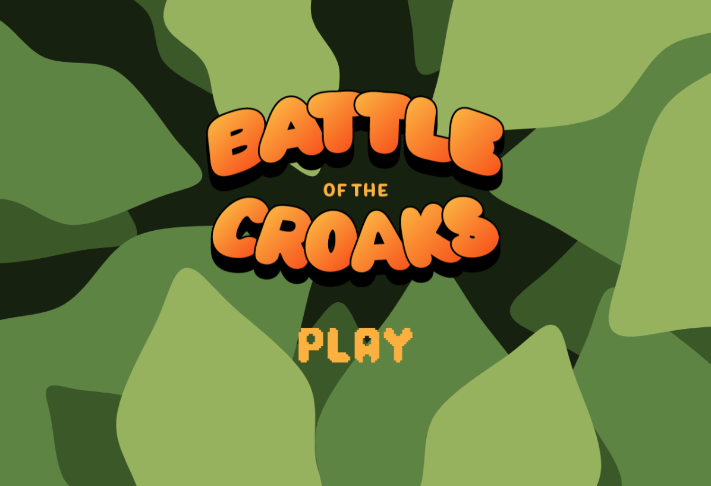
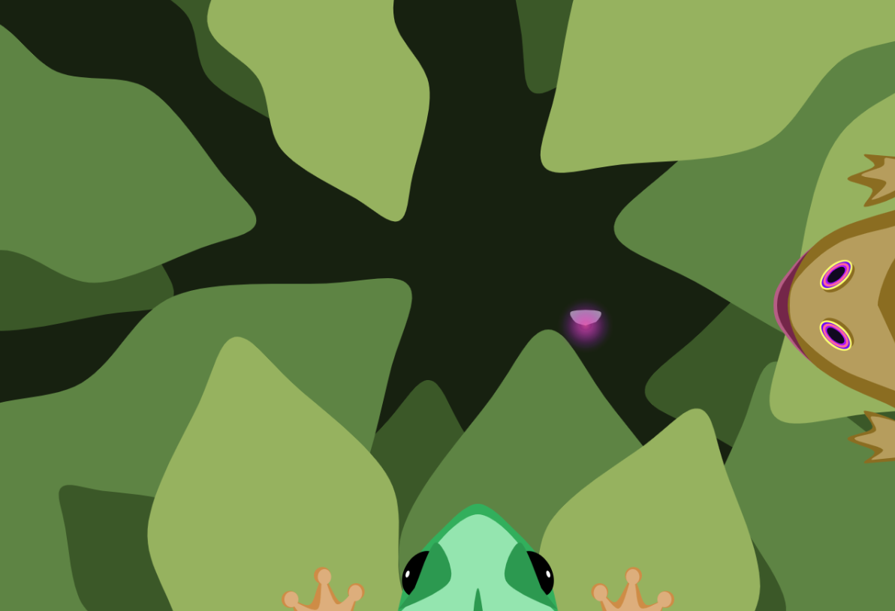

Mod Jam - Battle of the Croaks

BEN WOSCHITZ

- [Ideas](./ideas.md)

[View this project online](https://benwoschi.github.io/cart253/assignments/mod-jam)

## Description

> Mod Jam: Battle of the Croaks is a program where you eat flies and compete against an unnatural toad.

> It is quite simple, just move left or right with the mouse and time your clicks so that the tongue catches the flies.

> This project was built upon Pippin's frogfrogfrog idea, with an added competitive toad thrown into the mix. The Hypno Toad has no use for his tongue as he simply lures the flies into his mouth with his hypnotic eyes. He is a tyrant that steals other frog's and toad's dinner. Eat more flies than him to not go hungry and prove that his reign is not absolute.

## Screenshot(s)

>  > 

## Attribution

This bit should attribute any code, assets or other elements used taken from other sources. For example:

> - This project uses [p5.js](https://p5js.org).
> - Reference on how to make blinking text from a Stack Overflow forum (https://stackoverflow.com/questions/59505849/specific-blinking-on-p5js).
> - Toad and Frog SFX taken from a OSRS sound repository on Github (https://github.com/SoaresPT/OSRS-SoundEffects-Dumps/tree/main).

## License

> This project is licensed under a Creative Commons Attribution ([CC BY 4.0](https://creativecommons.org/licenses/by/4.0/deed.en)) license with the exception of libraries and other components with their own licenses.
