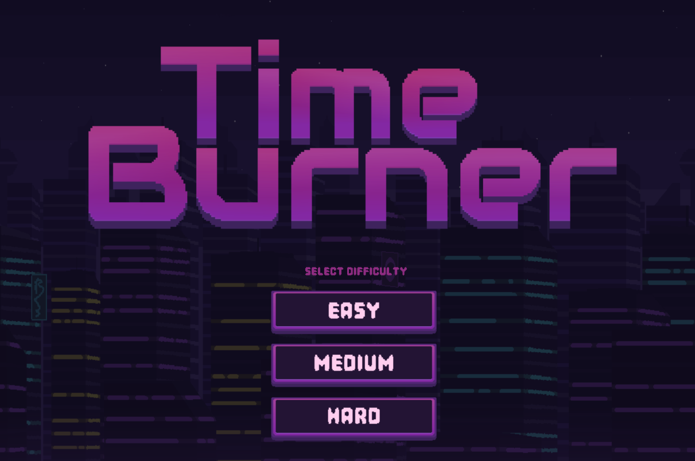
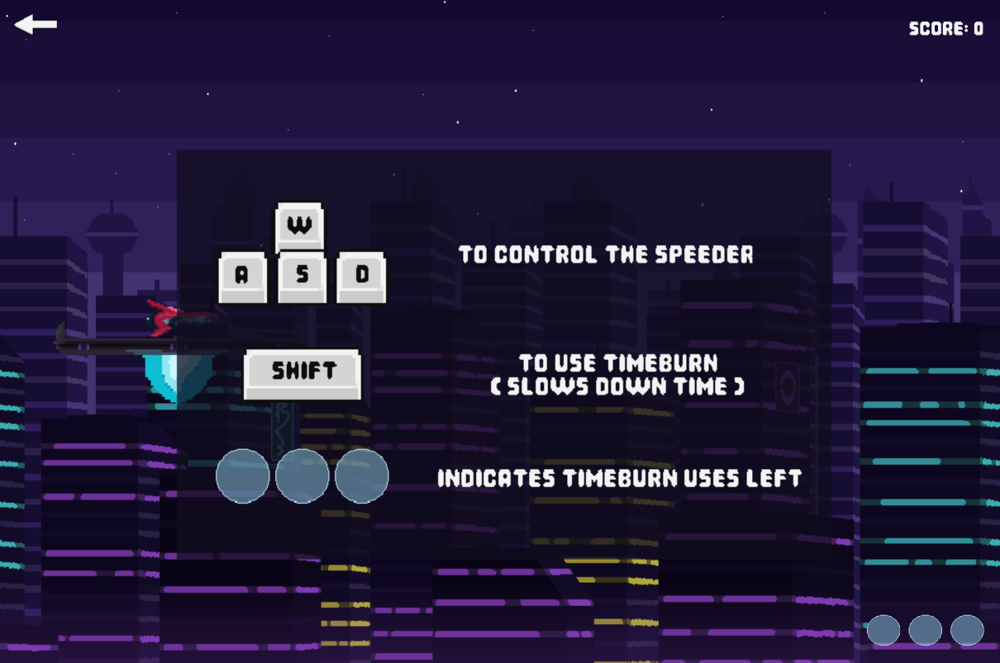
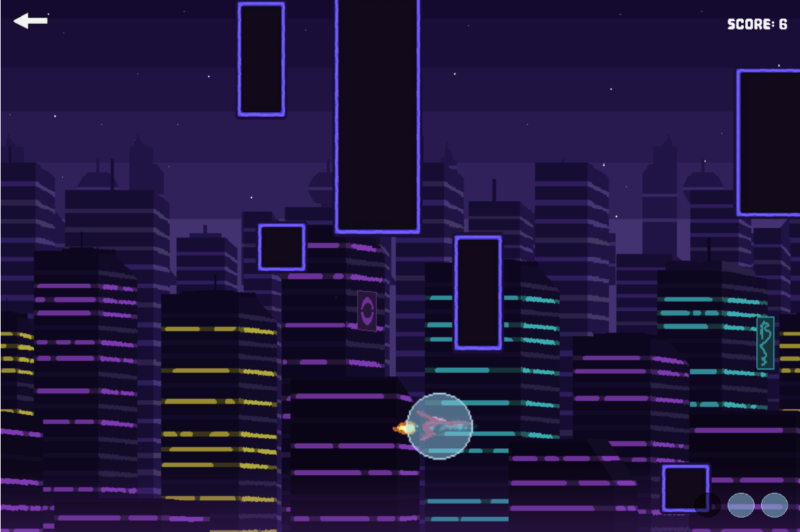
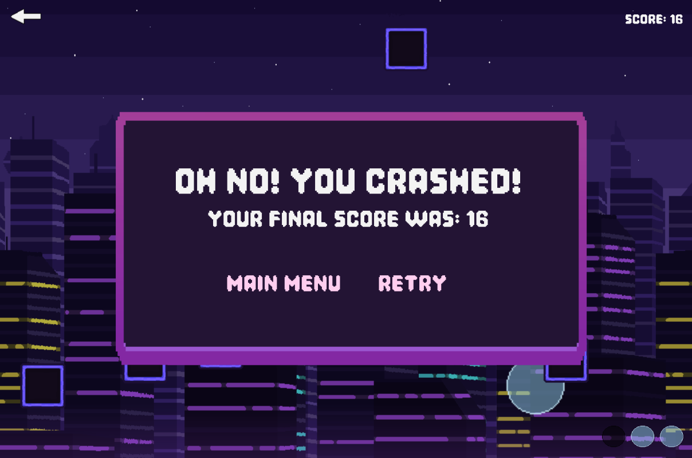

Variation Jam - Timeburner

BEN WOSCHITZ

[View this project online](https://benwoschi.github.io/cart253/assignments/variation-jam/)

## Description

> Variation Jam: A game about dodging obstacles and slowing down time in a speeder across a vast cyberpunk cityscape.

> It is quite simple, move left, right, up or down with WASD to dodge incoming obstacles and increase your score. Use SHIFT to slow down time for a few seconds and squeeze out of tight situations.

> This project was built upon the variation menu template. I had the idea of a flappybird-esque game where you have to dodge incoming objects with increasing difficulty. I was inspired for the themeing based off of a difficult synthwave-themed speeder/racer game named Redout 2.

## Screenshot(s)

>  >  >  > 

## Attribution

This bit should attribute any code, assets or other elements used taken from other sources. For example:

> - This project uses [p5.js](https://p5js.org).
> - Reference on how to make a scrolling background by chjno (https://editor.p5js.org/chjno/sketches/ByZlypKWM).
> - Reference on how to implement and make a sprite class by morejpeg (https://www.youtube.com/watch?v=eE65ody9MdI).
> - Reference on how to implement decent collision by rjgilmour (https://editor.p5js.org/rjgilmour/sketches/F8RUWBXIW).
> - Reference on how to implement lowpass in sound (https://p5js.org/reference/p5.sound/p5.LowPass/).
> - Menu Music by marcobellonimusic (https://pixabay.com/music/synthwave-space-racer-retro-synthwave-pop-193769/).
> - Level Music by NverAvetyanMusic (https://pixabay.com/music/synthwave-in-synthwave-153450/).
> - Engine start SFX by peridactyloptrix (https://pixabay.com/sound-effects/hover-engine-6391/).
> - Retry SFX by CreatorsHome (https://pixabay.com/sound-effects/on-001-337979/).
> - Menu select SFX by CreatorsHome (https://pixabay.com/sound-effects/digital-click-357350/).
> - Explosion SFX by Lumora_Studios (https://pixabay.com/sound-effects/pixel-explosion-319166/).
> - Time Distort SFX by yodguard (https://pixabay.com/sound-effects/warp-magic-6-382387/).

## License

> This project is licensed under a Creative Commons Attribution ([CC BY 4.0](https://creativecommons.org/licenses/by/4.0/deed.en)) license with the exception of libraries and other components with their own licenses.
