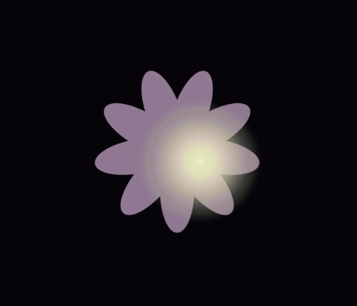

Art Jam - Self-Discovery

BEN WOSCHITZ

[View this project online](https://benwoschi.github.io/cart253/topics/art-jam/)

## Description

> Art Jam: Self-Discovery is a program in which you discover yourself within a dark void.

> It is quite simple, no clicking of any kind is required, just hovering your mouse around the screen to discover the flower.

> The project is more accurately a representation of myself and how I felt during the brainstorming process of this project, as well as in general. To this day I still struggle to understand myself and finding my own self worth, I struggle to understand what makes me, well.. me, and what that represents. I used the imagery of a flower as I am obsessed with lotus flowers in particular, but I didn't have the skillset to draw one within the program. It was really the only thing that I thought represented me in a more abstract way.

## Screenshot(s)

>  > 

## Attribution

This bit should attribute any code, assets or other elements used taken from other sources. For example:

> - This project uses [p5.js](https://p5js.org).
> - Reference on how [for] loops are used (https://p5js.org/reference/p5/for/).
> - Reference on how [lerpColor] is used (https://p5js.org/reference/p5/lerpColor/).
> - Reference used from elishafitra on how to sketch a flower on [canvas] (https://editor.p5js.org/elishafitri/sketches/nbrLz0idJ).

## License

> This project is licensed under a Creative Commons Attribution ([CC BY 4.0](https://creativecommons.org/licenses/by/4.0/deed.en)) license with the exception of libraries and other components with their own licenses.
